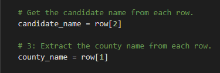

# Election_Analysis

## Overview of Election Audit
This election audit served two purposes, both of which revolved around creating a python script.  The first purpose was to analyze how votes were distributed between the counties of Jefferson, Denver and Arapahoe.  The second purpose of this audit was to analyze how votes were distributed among the candidates and determine which candidate won the popular vote.
## Election-Audit Results
- 369,711 total votes cast during the congressional election
  - County Breakdown
    - Jefferson:
      - 10.5% (38,855)
    - Denver:
      - 82.8% (306,055)
    - Arapahoe:
      - 6.7% (24,801)
  - Candidate Breakdown
    - Charles Casper Stockham
      - 23.0% (85,213)
    - Diana DeGette
      - 73.8% (272,892)
    - Raymon Anthony Doane
      - 3.1% (11,606)
- Largest Number of Votes: Denver

**Election Winner: Diana DeGette 73.8% (272,892)**
## Election-Audit Summary
The purpose of this challenge was to create a python script that could analyze vote distribution by county and by candidate and ultimately determine a winner.  With this script we were able to effectively perform an audit on an area of three counties which were represented by three candidates.  What this script has just performed is only the tip of the iceberg in terms of its capabilities and with enough time and resources, this script could be modified and used for any election.  One of the limitations with the current version of this script is that the file which contains the data that we are using for our analysis is hard coded into our script.  In order to utizilize this script in another election, the script would need to be modified to load the file that contains the data for that specific election.  Another modification that could be made to the script would be to prompt the user to input the file name that contains the data which they would like to run the analysis on.  If the file to be analyzed has the same column organization as the original file (i.e. Column A = Ballot Id, Column B = County, Column C = Candidate) then the script will work effectively without any modifications.  However, if the columns were organized in a different manner, then there would need to be some modifications to the script in regards to which columns we are looking for the data in.  For example, in the section of code shown below, the script looks for the candidate name in 'row[2]' and the county name in 'row[1]' but other election data files we analyze may not have this information in the same columns, therefore the column indices would need to be modified.

